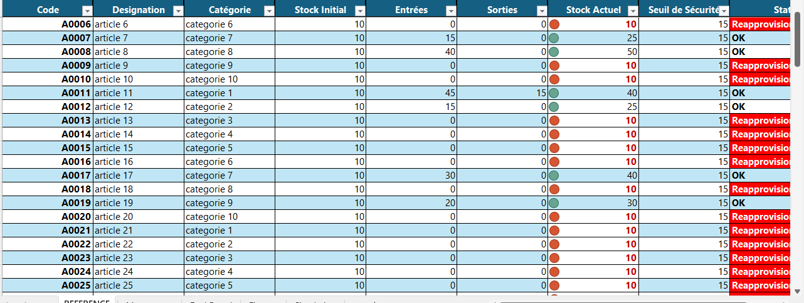
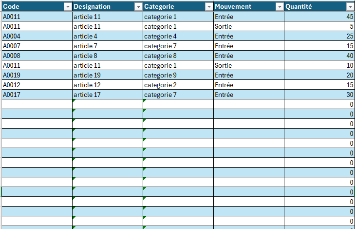
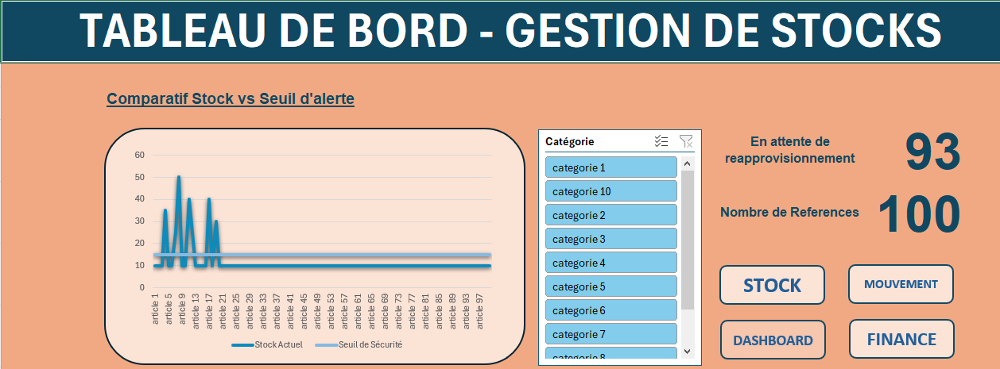
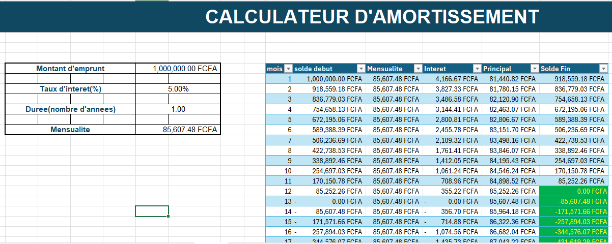

# ANALYSE DE DONNEES ET GESTION DES STOCK -ALIA-

## Documentation

Welcome to the Projet Excel documentation. This document provides an overview of the project, usage instructions, and links to relevant resources.

### Project Overview

The Projet Excel is designed to facilitate data processing and analysis using Excel. It includes various features that enhance the user experience and productivity.

### Features
- Data Import
- Data Export
- Data Visualization
- User Management

### Images
Below are links to some important images related to the project:
- 
- 
- 
- 

### Usage Instructions
To use the application, follow these steps:
1. Clone the repository.
2. Install the necessary dependencies.
3. Run the application.

### Conclusion
Thank you for using Projet Excel! For further assistance, please consult the documentation or contact the support team.
